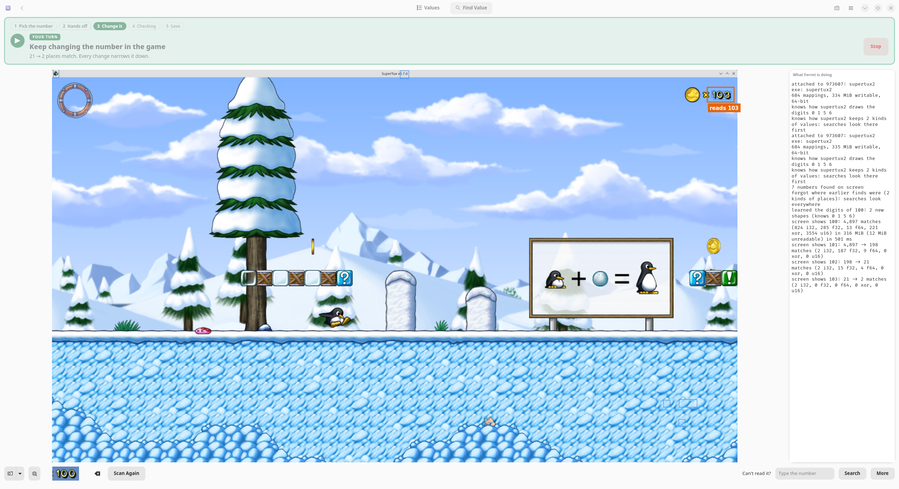
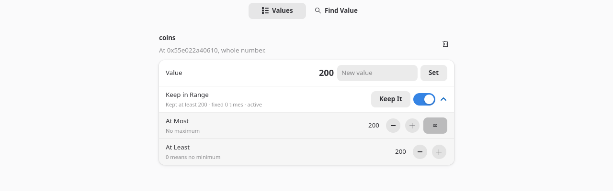

# Ferret

**Find and change values in your games.** Health, gold, ammo: pick the number in the game's
window, play a little, and Ferret finds where the game keeps it. Then set it, keep it from going
down, and get it back automatically every time you play. For single-player games on Linux.





<sub>The game in the screenshots is [SuperTux](https://www.supertux.org/), free and open source;
its artwork is under its own free licenses.</sub>

Ferret is in development: it works on the games listed below, but there are no ready-made
packages yet (see [Building](#building)).

## How it works

1. **Open your game** from the list of running games.
2. **Click the number** in the picture of the game window (or drag a box around it, around a
   health bar, or around a row of hearts). Ferret reads it, and learns how the game draws its
   digits as you go. If it can't read it, type the number instead.
3. **Press Start and play.** The bar at the top tells you when to keep your hands off and when
   it's your turn to change the number: pick up some coins, take a hit. Every change narrows the
   search. When a few places are left that all follow the number, Ferret writes test values to
   tell the real one from the game's display copies; if it still can't tell, you try them.
4. **Save it with a name.** Ferret works out how the game gets to the value, so it finds it
   again after the game restarts, usually within a second or two of opening the game.
5. **Change it** in the Values tab, or **keep it in a range** (Keep It: never below the number
   now). Limits keep working while you play, even with Ferret's window closed; a hotkey turns
   them off and on from inside the game.

Notifications tell you what Ferret needs while the game is in front, even in fullscreen.

## Single-player only

Ferret never touches online games. It refuses to open a game when:

- anti-cheat runs in it or next to it (EasyAntiCheat, BattlEye and others), checked again every
  few seconds while it's open: if anti-cheat starts, Ferret lets go at once;
- the store lists it as online-only or an MMO;
- it uses Valve Anti-Cheat (except Source games started with `-insecure`);
- it flags edited characters when they go online (the Souls games, Elden Ring).

Games that ship anti-cheat they don't run, or that have a multiplayer mode, open with a warning:
change values only while you play alone and offline. Ferret looks at what runs, what's in the
game's folder, the store's information (Steam, Heroic) and
[AreWeAntiCheatYet](https://areweanticheatyet.com/)'s list.

## Games

Native Linux games and Windows games under Proton or Wine, from Steam, Heroic, Lutris or anywhere
else. Ferret finds values again by the game's own code, by the names Unreal, Unity (Mono and
IL2CPP) and Godot games give their objects, or by pointer paths. Tried so far, among others:
SuperTux, Terraria, Valheim, ULTRAKILL, Creeper World 4, Brotato, Lumencraft, Forager, Prey,
Mass Effect: Andromeda, Starship Troopers: Ultimate Bug War!, Quake II RTX, Skyrim Special Edition,
and Flash games in Ruffle. Java games (Shattered Pixel Dungeon) are only shown, not changed yet.

Values a game hides (memory scramblers like CodeStage Anti-Cheat Toolkit in some Unity games)
can't be found: Ferret says so when you open such a game.

## Sharing

- **Export / import:** a game's saved values as a small `.ferret` text file, or copied to paste
  in a chat. Imported values aren't changed until you confirm the game shows their number.
- **Shared library:** browse values other players shared for the same game, and share your own
  (only values you confirmed, nothing about you or your computer). When you confirm or remove a
  value you got from it, Ferret tells the library whether it worked.
- **Send Feedback:** a message to the developer, optionally with Ferret's log (your home
  folder's path taken out) and the game's saved values. You see exactly what's sent.

Ferret goes online only for these (its own server, on Cloudflare); nothing else leaves your
computer.

## Languages

English, German, Spanish, French, Italian, Polish, Brazilian Portuguese, Russian and Simplified
Chinese. The translations are machine-made and not reviewed by native speakers yet: corrections
are welcome (`po/`).

## Building

Ferret is a flatpak (GTK 4 and libadwaita, written in Rust). It needs the GNOME 50 SDK and the
Rust extension:

```sh
flatpak install --user flathub org.gnome.Sdk//50 org.freedesktop.Sdk.Extension.rust-stable//25.08 org.flatpak.Builder
# the crates, once and after changing dependencies (vendor/ is gitignored)
mv .cargo/config.toml .cargo/config.toml.off
flatpak run --share=network --filesystem="$PWD" --command=sh org.gnome.Sdk//50 \
    -c 'cd "$0" && /usr/lib/sdk/rust-stable/bin/cargo vendor --versioned-dirs vendor' "$PWD"
mv .cargo/config.toml.off .cargo/config.toml
# build and install
flatpak run org.flatpak.Builder --user --install --force-clean --disable-rofiles-fuse \
    build-dir io.github.Petru101.Ferret.yml
flatpak run io.github.Petru101.Ferret
```

The app is sandboxed; reading and writing a game's memory happens in a small helper
(`ferret-helper`, Rust with only the standard library and libc, linked statically) that Ferret
starts on the host with `flatpak-spawn --host`, because games run outside the sandbox. The game
window comes through the ScreenCast portal: only the window you pick, never your desktop. If your
system doesn't allow one program to read another's memory (`kernel.yama.ptrace_scope`), Ferret
explains how to allow it.

`flatpak run io.github.Petru101.Ferret --cli` is a text interface used by the test scripts:
`test-game/` has a stand-in game and scripts that drive it (natively, under Proton and in the
Steam Linux Runtime), and `bench/` compares OCR engines on saved game frames.

## Third-party data

- Numbers are read with PaddlePaddle's PP-OCRv6 small text detection and recognition models
  ([PaddleOCR](https://github.com/PaddlePaddle/PaddleOCR), Apache License 2.0), downloaded from
  PaddlePaddle's Hugging Face repositories at build time and run with
  [rten](https://github.com/robertknight/rten).
- `data/areweanticheatyet/games.json` is a trimmed copy of AreWeAntiCheatYet's `games.json`
  (MIT License, Copyright © 2021 Starz0r, Curve; see `data/areweanticheatyet/LICENSE` and
  `SOURCE`). Refresh it with `data/areweanticheatyet/update.sh` before a release.

## License

GPL-3.0-or-later (`LICENSE`).
